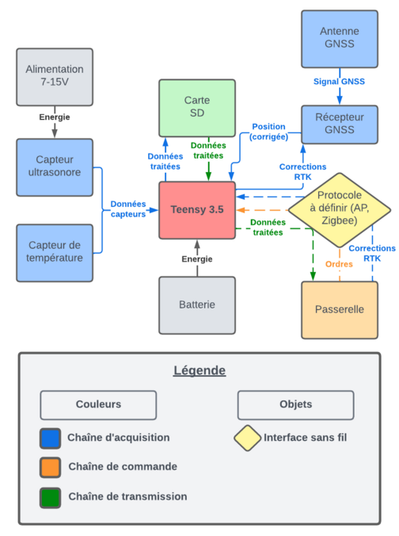

Satellite Cyclopée
==================

## Description
Le satellite Cyclopée est destiné a être embarqué à bord de vehicules terrestres ou acquatiques pour réaliser des mesures GNSS. 
Il permet d'enregistrer les données GNSS brutes fournies par un récpeteur GNSS ZED-F9P sur une carte SD pour post traitement.
Il permet également d'enregistrer sa position GNSS associée à la hauteur mesurée, compensée par rapport à la température ambiante, entre lui-même et le sol / la surface de l'eau.

## Cahier des charges
Pour dresser le cahier des charges de ce satellite nous avons raisonné en termes de scénari d'utilisation. Les scénari relevés conernent principalement des intervalles de meusre intensifs sur des périodes de déploiement assez courtes ou des fréquences plus douces mais des périodes de déploiement plus longues :

|Scénario|Fréquence d'acquisition|Autonomie|Précision|Mesurandes secondaires|Remarques|
|--------|-----------------------|---------|---------|--------------------------|---------|
|Mesure continue|10Hz|1 mois à bord d'un navire (alimentation externe)|1cm (1mm?)|Température Pression atmosphérique (0,1hPa)||
|Mesure de référence|?|Alimentation externe|1mm||Toit du LIENSs Quantification des dérives|
|Mesure de niveau d'eau en marais|~15min|?|<1cm||
|Mesure de marées/vagues (bouée?)|Burst toutes les 10-15min|10-20 jours|1cm (1mm?)|||
|Transatlantique|1Hz ou ~30min|Le + possible Recharge solaire|1m|||

La réalisation de deux versions de Cyclopée a donc été envisagée. Une destinée aux mesures intensives et l'autre aux utilisations plus douces. Elle possèderont les caratéristiques communes suivantes :

- Facilité de déploiement;
- Logs de données :
	+ Stockage interne des logs de données;
	+ Segmentation des fichiers de log;
- Autonomie :
	+ Alimentation externe & sur batterie;
	+ Possibilité de recharge solaire;
- Monitoring :
	+ Consultation des données depuis la passerelle;
	+ Envoi des données à un serveur central via la passerelle;
- Mesurandes secondaires :
	+ Pouvoir accueillir une station pression/température.

La version 

Le satellite est en cours de développement, pour l'instant seuls les capteurs de distance et de température ont été testés et le montage suivant de mesure de distance compensée a été réalisé :

## Matériel
- Teensy 3.5 (ou ESP32 Joy It);
- Antenne GNSS multi-bandes IP66;
- Récpeteur GNSS Ublox ZED-F9P;
- Mikroe RS485 click 2;
- Capteur ultrasonore DFRobot URM14;
- Sonde DallasTemperature DS18B20;
- Résistance pullup 4.7kOhms;
- Alimentation (URM14) 7-15V;
- Alimentation (Board) 5 or 3.3V.

## Branchements

|Teensy|ESP32|Interface RS485|
|------|-----|---------------|
|TX4|D2|RX|
|RX4|D4|TX|
|30|D5|DE & RE|
|3V3|3V3|3V3|
|GND|GND|GND|

Le capteur URM14 doit être alimenté entre 7 et 15V !

|URM14|Interface RS485|Alimentation 7-15V|
|---------------|-----|------------------|
|Fil Blanc|A||
|Fil Bleu|B|
|Fil marron||Borne +|
|Fil noir||Borne -|

|Teensy|ESP32|DS18B20|
|------|-----|-------|
|3V3|3V3|Fil Orange|
|GND|GND|Fil Blanc|
|30|D18|Fil Jaune|

## Tests unitaires
Le dossier `unit_tests` de ce répertoire propose des exemples de programmes permettant de tester le matériel, notamment le capteur ultrasonore, la sonde de température et la carte SD.