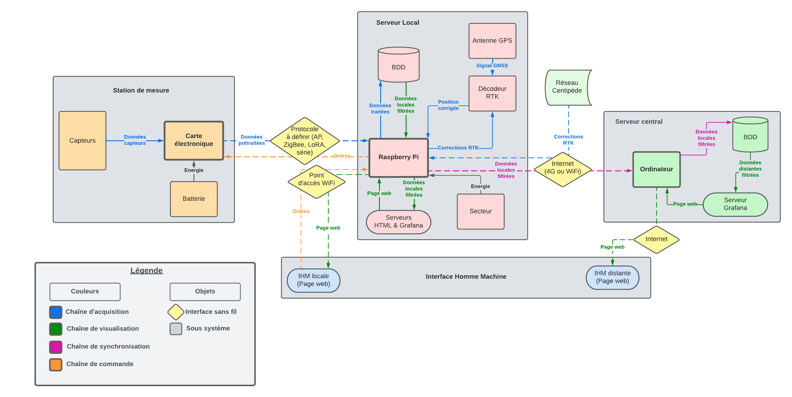

Valise Multicapteurs
====================
Cahier des charges fonctionnel
------------------

### Fonctionnalités :

#### Energie :

- Etre mis sous/hors tension :
	+ Interrupteur.

#### Traitement des données

- Mesurer :
	+ Température.
	+ Conductivité (salinité).
	+ O2 dissous.
	+ Turbidité.
	+ Chlorophylle.
	+ pH.
- Mesures géoréférencées et horodatées :
	+ Calcul de position, date, heure (Décodeur GNSS RTK + réseau Cenipède).
- Stockage sur un serveur central distant :
	+ Envoi des données à un serveur central (Internet : clé 4G ou Wifi).
- Stockage local (pas d'accès internet) :
	+ BDD locale.
	+ Synchronisation des données locales sur le serveur central.
- Visualisation des données pour utilisateurs locaux et distants.

#### Commande système :

- Demande de calibration.
- Demande de mesure.
- Ordre de mise en veille.
- Ordre de mise hors tension :
	+ Interrupteur piloté / Relai.

#### Interface utilisateur
- Visualisation :
	+ Par grandeur.
	+ En direct (valeur actuelle d'une sonde).
	+ Sur une période.
- Calibration.
	
### Contraintes :

#### Installation :

- Facile à installer :
	+ Hardware :
		*	Facile à se procurer.
		*	Facile à monter.
	+ Software :
		* Facile à installer et configurer.
	+ Instalation à bord facile.

#### Energie :

- Source d'alimentation difficile d'accès pour la station de mesure :
	+ Fonctionner sur batterie.
	+ Rechargeable.
- Autonomie maximale :
	+ Economie d'énergie :
		* Mise en veille de la station.
		* Protocoles économes (BLE, Zigbee, etc.).

#### Coût :

- Système à prix abordable (à définir) :
	+ Composants abordables.
	+ Mesures exploitables à faible coût :
		* Capteurs low cost mais fiables.
- Faible maintenance :
	+ Capteurs à faible maintenance (pas de membranes -> optiques).

#### Milieu marin :

- Etanche et résistant :
	+ Capteurs étanches, robustes.
	+ Boîtier étanche (station).

#### Interactions utilisateur :

- User friendly :
	+ Interface d'aide à la calibration simple.
	+ Visualisation des données aisée.
	+ Commande du système simple.

### Diagramme des flux global du système :
	

### Idées :

#### Serveur local :

- Raspberrry Pi.

#### Station de mesure :
- Boards candidates :

| Board | Protocoles de communication |
|-------|-----------------------------|
| **Teensy + Module Zigbee** | Zigbee |
| **SparkFun Thing Plus XBee3 Micro** | Zigbee |
| **LilyGO T-Zigbee** | ES32 : WiFi, Bluetooth   TLSR8258 : Zigbee, BLE5 |
| **ESP32** | Bluetooth, WiFi |
| **Wio-E5 mini** | LoRa |
